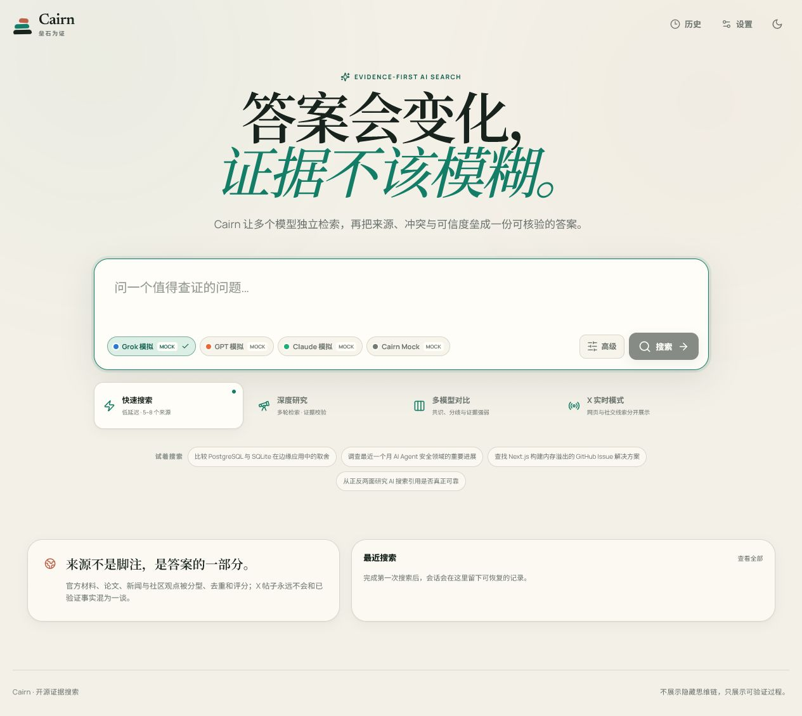

# Cairn

> Evidence-first, multi-model AI search. 不只给答案，也交付可核验的证据路径。



Cairn is a TypeScript monorepo for web research with recoverable sessions, ranked sources, evidence snippets, inline citations, and citation verification. It provides the same search engine through a modern Next.js interface, a stdio MCP server, a CLI, and a project-level Claude Code Agent Skill.

The project was designed from scratch. It borrows only general product ideas such as asynchronous tasks, streaming, history, and Provider configuration; it does not copy askr source code, structure, naming, UI, prompts, or implementation details.

## What is implemented

- Four search modes: quick search, deep research, multi-model comparison, and X real-time signals.
- Provider-specific adapters for xAI Responses, OpenAI Responses, Anthropic Messages, and a deterministic free Mock Provider.
- Intent classification, differentiated query planning, bounded parallel retrieval, URL normalization, source clustering and scoring, evidence extraction, synthesis, and citation checks.
- Recoverable SQLite sessions and event logs; SSE reconnects from an event sequence instead of discarding progress.
- Search, result, comparison, history, and Provider settings screens with responsive light/dark themes and keyboard-accessible controls.
- Masked server-side Provider configuration, model discovery, connection tests, role-model assignment, rate limiting, request limits, SSRF guards, and graceful shutdown.
- Structured MCP tools for quick/deep/parallel/comparison/X research, status, results, cancellation, and history.
- CLI search, comparison, status, results, cancellation, history, and Provider inspection.
- Project-level `.claude/skills/researching-with-ai` skill with references, five trigger cases, and a free health check.

## Architecture

```text
apps/
  web/          Next.js UI, Route Handlers, SSE
  mcp/          stdio MCP server
  cli/          terminal interface
packages/
  shared/       domain types, schemas, limits, events, URL/text utilities
  providers/    xAI, OpenAI, Anthropic, Mock adapters
  storage/      SQLite, Drizzle schema, migrations, repository
  search-core/  planning, retrieval, ranking, evidence, synthesis, verification
.claude/
  skills/researching-with-ai/
deploy/         production service and nginx templates
```

All entry points call `search-core`; Web, MCP, and CLI do not maintain separate search logic. See [architecture details](docs/architecture.md) and [search quality rules](docs/search-quality.md).

## Requirements

- Node.js 20 or newer
- Corepack
- pnpm 11.17.0 (declared in `package.json`)

## Quick start with no API key

```bash
corepack pnpm install
copy .env.example .env
```

Set `CAIRN_MOCK=1` in `.env`, then:

```bash
corepack pnpm dev
```

Open `http://127.0.0.1:3000`. Mock mode exercises the complete search, streaming, persistence, evidence, citation, comparison, CLI, and MCP paths without a paid API.

On macOS or Linux, use `cp .env.example .env`.

## Provider configuration

Real Providers read keys only on the server:

```dotenv
XAI_API_KEY=
OPENAI_API_KEY=
ANTHROPIC_API_KEY=
```

Optional Base URLs and model IDs are configurable. Cairn intentionally does not hard-code an assumed “latest” model. Use `/settings` or server-side configuration to select the deployed model IDs.

| Provider | API shape | Native web | X search | Streaming | Citations |
|---|---|---:|---:|---:|---:|
| xAI / Grok | Responses API | Yes | Yes | Yes | Yes |
| OpenAI / GPT | Responses API | Yes | No | Yes | Yes |
| Anthropic / Claude | Messages API | Yes | No | Yes | Yes |
| Cairn Mock | Local fixtures | Simulated | Simulated label | Yes | Yes |

Provider capabilities are declared explicitly. An OpenAI-compatible Base URL is never assumed to support web search merely because it accepts chat requests.

## Search modes

- **Quick (`flash`)**: one main Provider, two focused queries, normally 5–8 sources.
- **Deep (`dive`)**: broader query roles, cross-checks, counter-evidence, and up to 30 candidate sources.
- **Comparison (`panel`)**: two or three Providers research independently; Cairn preserves their answers and synthesizes consensus and disagreement.
- **X real-time (`pulse`)**: uses a Provider with social search and keeps social material visibly separate and unverified.

Every mode supports bounded concurrency, timeouts, cancellation, finite exponential-backoff retries, Provider fallback, and partial results.

## CLI

Build once:

```bash
corepack pnpm --filter @cairn/cli build
```

Examples:

```bash
node apps/cli/dist/index.js search "What changed in this API?" --provider mock --json
node apps/cli/dist/index.js search "Compare two approaches" --mode dive --provider mock
node apps/cli/dist/index.js compare "PostgreSQL or SQLite at the edge?" --provider xai openai
node apps/cli/dist/index.js history --limit 10
node apps/cli/dist/index.js result <session-id> --json
```

Set `CAIRN_DB_PATH` to the same database path used by Web if you want both surfaces to share history.

## MCP server

Build and launch:

```bash
corepack pnpm --filter @cairn/mcp build
node apps/mcp/dist/index.js
```

Client configuration shape:

```json
{
  "mcpServers": {
    "cairn": {
      "command": "node",
      "args": ["/absolute/path/to/cairn/apps/mcp/dist/index.js"],
      "env": {
        "CAIRN_DB_PATH": "/absolute/path/to/cairn/data/cairn.db",
        "CAIRN_MOCK": "1"
      }
    }
  }
}
```

Available tools:

- `cairn_flash_search`
- `cairn_deep_research`
- `cairn_parallel_questions`
- `cairn_compare_models`
- `cairn_x_pulse`
- `cairn_task_status`
- `cairn_get_result`
- `cairn_cancel_task`
- `cairn_recent_history`

Long MCP tasks return a session ID so clients can query status and recover partial or completed results later.

## Claude Code Agent Skill

The repository contains `.claude/skills/researching-with-ai/SKILL.md`. Open the repository in Claude Code so the project-level skill can be discovered. It should trigger for current API research, technical comparisons, recent news, GitHub Issue troubleshooting, and disputed claims requiring evidence on both sides.

Validate it without paid calls:

```bash
node .claude/skills/researching-with-ai/scripts/healthcheck.mjs --smoke
```

## Data and migrations

SQLite persists sessions, tasks, planned queries, sources, evidence, answers, citations, Provider usage, application settings, and ordered events. Migrations run idempotently when the repository opens. The default path is `./data/cairn.db`; the directory and database files are ignored by Git.

## Security boundaries

- API keys never enter browser payloads, client bundles, normal logs, or Git.
- Zod validates API inputs; request bodies and query lengths are bounded.
- Rate limiting applies to search creation.
- The secure fetcher allows only HTTP(S), resolves DNS, blocks private/link-local/loopback targets, bounds redirects and body size, and honors timeout/abort signals.
- HTML is reduced to safe text before evidence extraction.
- Provider errors are classified; only bounded retryable failures are retried.
- Social content is labeled unverified.
- The UI exposes a public research plan and progress events, never hidden chain-of-thought.

## Tests and quality gates

```bash
corepack pnpm lint
corepack pnpm typecheck
corepack pnpm test
corepack pnpm test:e2e
corepack pnpm build
```

The test suite covers Provider contracts, stream parsing, URL canonicalization, deduplication, scoring, evidence and citations, SSRF controls, timeout/cancel/retry, SQLite recovery, search-core integration, MCP calls, Agent Skill validation, and desktop/mobile Playwright search recovery.

## Production deployment

`next.config.ts` creates a standalone build. Templates for systemd and nginx are in `deploy/`. The nginx template disables proxy buffering for SSE and keeps the Node service bound to localhost.

The intended production layout is:

```text
/opt/cairn/
  current -> releases/<release>/runtime/
  releases/<release>/
    source/
    runtime/apps/web/server.js
    runtime/apps/web/.next/static/
  shared/
    data/cairn.db
    .env
```

Use `deploy/cairn.service` and `deploy/question.nginx.conf` as reviewed templates, not blind installers.

## Known limits

- Real Provider APIs evolve; configure tested model IDs and review Provider contract tests when upstream event formats change.
- Plain HTML fetching cannot render every JavaScript-only or authenticated page.
- Price estimates appear only when a price table is configured.
- Mock results validate behavior and data flow, not arbitrary current-world facts.
- Social search is available only through a capable configured Provider and remains unverified evidence.

## License

[MIT](LICENSE)
